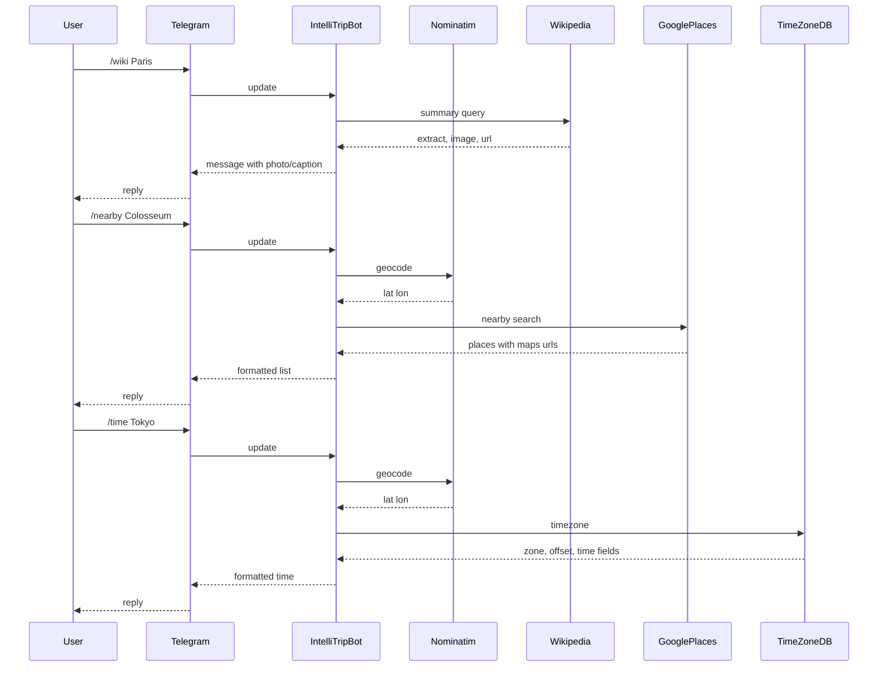

# Business Requirements Document (BRD)

## IntelliTripBot — Travel Planning Assistant

---

### 1. Document control

| Field | Value |
| ----- | ----- |
| Product name | IntelliTripBot |
| Type | Telegram bot — Travel Planning Assistant |
| Primary stack | Python, `python-telegram-bot` (v21+ async recommended) |
| Status | Requirements baseline for v1 |

---

### 2. Executive summary

IntelliTripBot helps travelers quickly answer **what a place is** (Wikipedia), **what is nearby** (attractions with maps), and **local time** (timezone-aware). It targets users who want fast, link-rich answers inside Telegram without opening multiple apps.

---

### 3. Goals and success criteria

**Business / product goals**

- Reduce friction when researching a destination or stopover.
- Drive outbound engagement to authoritative sources (Wikipedia, Google Maps).
- Keep implementation maintainable with clear separation of external API clients.

**Success metrics (v1)**

- Commands `/wiki`, `/nearby`, `/time` return a useful answer for typical city/landmark queries within **10–15 seconds** (p95) under normal API latency.
- **Error messages** are user-friendly (rate limit, not found, invalid API key) without exposing internals.
- **Operational**: bot process restarts cleanly; configurable logging level.

---

### 4. Stakeholders and users

| Role | Interest |
| ---- | -------- |
| End user (traveler) | Quick facts, maps, local time |
| Operator / maintainer | Keys, quotas, monitoring, deploy |
| Content providers | Wikipedia, OSM/Nominatim, Google, TimeZoneDB ToS compliance |

---

### 5. Scope

**In scope (v1)**

- Three commands as specified, with place names as free text.
- Geocoding via **OpenStreetMap Nominatim** to resolve `<place>` to coordinates where APIs require them (Places nearby, timezone).
- Wikipedia: short summary, one image when available, canonical article URL.
- Nearby: list of attractions with **Google Maps** URLs (place or search URLs as appropriate).
- Time: local time and IANA-style timezone name from **TimeZoneDB** (or documented fallback behavior).

**Out of scope (v1)**

- User accounts, saved trips, itineraries, bookings, payments.
- Multi-step conversational flows (unless later defined).
- Non-Latin place disambiguation UX beyond “first Nominatim result” unless extended.

---

### 6. Functional requirements

#### FR-1 — `/wiki <place>`

| ID | Requirement |
| -- | ----------- |
| FR-1.1 | Accept `place` as one or more words after the command. |
| FR-1.2 | Resolve the place to a Wikipedia page (e.g., via Wikipedia API `opensearch` or `pagesummary` / REST `page/summary/{title}` for English, with documented default language). |
| FR-1.3 | Reply with: **title**, **extract** (truncated to Telegram-safe length, e.g. ~3500 chars with ellipsis), **one thumbnail/full image** if `originalimage` / `thumbnail` exists, **link** to the Wikipedia article. |
| FR-1.4 | If no article: clear message (“No Wikipedia article found for …”). |

#### FR-2 — `/nearby <place>`

| ID | Requirement |
| -- | ----------- |
| FR-2.1 | Geocode `<place>` with Nominatim → lat/lon. |
| FR-2.2 | Call **Google Places API** (Nearby Search or Text Search — exact endpoint fixed in technical design; **Places API (New)** is the current Google direction) for tourist-relevant types (e.g., `tourist_attraction`, `museum`, `park`, `point_of_interest`) within a default radius (e.g. **1500 m**, configurable). |
| FR-2.3 | Return a **numbered or bulleted list**: name, optional rating, **Google Maps link** per result (limit, e.g. **5–10** results). |
| FR-2.4 | If geocoding fails or no results: user-visible error. |

#### FR-3 — `/time <place>`

| ID | Requirement |
| -- | ----------- |
| FR-3.1 | Geocode `<place>` with Nominatim. |
| FR-3.2 | Call **TimeZoneDB** (e.g., `get-time-zone` by lat/lon) for **zone name** and offset; display **current local time** in that zone (compute client-side from API response or use API fields as documented). |
| FR-3.3 | Show **timezone name** (e.g., `Europe/Berlin`) and **UTC offset** where available. |
| FR-3.4 | If resolution fails: user-visible error. |

#### FR-4 — Cross-cutting behavior

| ID | Requirement |
| -- | ----------- |
| FR-4.1 | **Help**: `/start` and `/help` describe commands and mention that external services apply. |
| FR-4.2 | **Rate limiting**: Respect Nominatim usage policy (identifying `User-Agent`, cache where possible, avoid burst traffic). |
| FR-4.3 | **Secrets**: API keys via environment variables (Telegram token, Google API key, TimeZoneDB key). Never commit secrets. |

---

### 7. Non-functional requirements

| ID | Category | Requirement |
| -- | -------- | ------------- |
| NFR-1 | Availability | Single-instance deployment acceptable v1; document process manager (systemd, Docker, etc.). |
| NFR-2 | Security | Validate Telegram updates; HTTPS-only external calls. |
| NFR-3 | Observability | Structured or leveled logs for command invocation (no PII beyond place string if policy requires minimization). |
| NFR-4 | i18n | UI strings in **English** v1; Wikipedia language default **en** (configurable later). |
| NFR-5 | Compliance | Honor [Nominatim Usage Policy](https://operations.osmfoundation.org/policies/nominatim/), Google Maps Platform ToS, Wikipedia [API etiquette](https://foundation.wikimedia.org/wiki/Policy:Wikimedia_Foundation_API_guidelines), TimeZoneDB ToS. |

---

### 8. External dependencies and configuration

| Service | Purpose | Required config |
| ------- | ------- | ----------------- |
| Telegram Bot API | Messaging | `TELEGRAM_BOT_TOKEN` |
| Nominatim (OSM) | Geocoding | Custom `User-Agent` + contact per policy |
| Wikipedia | Summaries / images | Optional language param |
| Google Places | Attractions | API key + enabled Places API (product); billing account |
| TimeZoneDB | Timezone / local time | API key |

**Technical note:** Google has migrated toward **Places API (New)**; implementation pins one approach in v1 and validates map URL construction from `place_id` or coordinates.

---

### 9. Assumptions and constraints

- Users have Telegram; no web UI v1.
- “Place” quality depends on Nominatim; ambiguous names may return the wrong city—v1 may show the **resolved display name** from geocoder for transparency.
- Image sending in Telegram may fail for large URLs; fallback: send caption + link only.
- API quotas and costs are the operator’s responsibility (especially Google).

---

### 10. Risks and mitigations

| Risk | Mitigation |
| ---- | ---------- |
| Nominatim blocks or throttles | Strict User-Agent, caching, low QPS, optional self-hosted Nominatim later |
| Google billing / quota errors | Graceful message; monitor Cloud console |
| Wikipedia summary empty for disambiguation pages | Detect `type` / disambiguation and suggest refining query |
| Long-running requests | asyncio timeouts; typing indicator (`send_chat_action`) |

---

### 11. Future enhancements (backlog — not v1 commitments)

- Inline buttons: “Open in Maps”, “More results”
- Language selection for Wikipedia
- Cached popular destinations

---

### 12. Acceptance criteria (v1 sign-off)

- All three commands work end-to-end with valid API keys for at least three test places (city, landmark, small town).
- `/help` lists commands and data sources.
- Failures produce concise user messages; logs contain enough detail for debugging.
- `README.md` documents env vars and how to run locally and in production.

---

### Appendix A — Reference architecture (data flow)



---

### Appendix B — Suggested repository layout

```text
IntelliTrip_Bot/
  .env.example
  requirements.txt
  README.md
  src/
    bot.py
    config.py
    clients/
      nominatim.py
      wikipedia.py
      google_places.py
      timezonedb.py
    handlers/
      wiki.py
      nearby.py
      time_cmd.py
```
